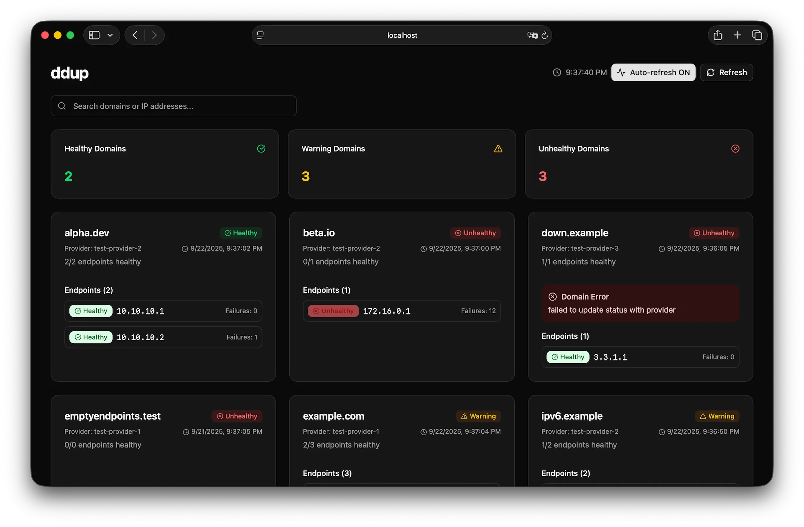

# ddup - Dynamic DNS Health Checker

ddup periodically checks the health of your services and updates the DNS records pointing to healthy deployments.

You can use ddup to configure [round-robin DNS](https://en.wikipedia.org/wiki/Round-robin_DNS) for load balancing and failover, for internal or external apps, automatically excluding un-healthy replicas.

ddup is **not** a DNS server, instead it works with "dynamic" DNS servers. Currently, it supports these DNS providers:

- Azure DNS
- Cloudflare DNS
- OVH



## Installation

### Using Docker/Podman

You can run ddup as a Docker/Podman container. Container images are available for Linux and support amd64, arm64, and armv7/armhf.

First, create a folder where you will store the configuration file `config.yaml`, for example `$HOME/.ddup`. You can then start ddup with:

```sh
# For podman, replace "docker run" with "podman run"
docker run \
  -d \
  --read-only \
  -v $HOME/.ddup:/etc/ddup:ro \
  ghcr.io/italypaleale/ddup:v0
```

> ddup follows semver for versioning. The command above uses the latest version in the 0.x branch. We do not publish a container image tagged "latest".

### Using Docker Compose

This is an example of a `docker-compose.yaml` for running ddup:

```yaml
version: "3.6"

services:
  ddup:
    image: "ghcr.io/italypaleale/ddup:v0"
    volumes:
      # Set the path on the host OS
      - "/path/to/ddup:/etc/ddup:ro"
    restart: "unless-stopped"
    read_only: true
    logging:
      driver: "json-file"
      options:
        max-file: "5"
        max-size: "20m"
```

### Start as standalone app

You can download the latest version of ddup from the [Releases](https://github.com/italypaleale/ddup/releases) page. Fetch the correct archive for your system and architecture, then extract the files and copy the `ddup` binary to `/usr/local/bin` or another folder.

Place the configuration for ddup in the `/etc/ddup` folder.

You will need to start ddup as a service using the process manager for your system.

For example, for Linux distributions based on **systemd** you can use the sample unit in [`ddup.service`](./ddup.service): copy this file to `/etc/systemd/system/ddup.service`.

Start the service and enable it at boot with:

```sh
sudo systemctl enable --now ddup
```

## Configuration

ddup requires a configuration file `config.yaml` in one of the following paths:

- `/etc/ddup/config.yaml`
- `$HOME/.ddup/config.yaml`
- Or in the same folder where the ddup binary is located

> You can specify a custom configuration file using the `DDUP_CONFIG` environmental variable.

You can find an example of the configuration file, and a description of every option, in the [`config.sample.yaml`](/config.sample.yaml) file.

## Configuration Options

### Global Settings

- `interval`: How often to perform health checks (e.g., "30s", "1m", "5m")

### Domains and Endpoints

- `domains`: Array of domains to manage
  - `recordName`: The DNS record to update (e.g., "api.example.com")
  - `provider`: Name of the DNS provider (from the [`providers` map](#providers-configuration))
  - `ttl`: Time to live for DNS records. A short value is preferred to ensure faster failover from failed deployments. The default value is 120 (seconds, equivalent to 2 minutes)
  - `healthChecks`: Configuration for health checks
    - `timeout`: Request timeout (default: "3s")
    - `attempts`: Maximum number of consecutive attempts before considering the endpoint unhealthy (default: 2)
  - `endpoints`: Array of endpoints for this domain
    - `name`: Friendly name for the endpoint, used for logging (optional)
    - `url`: HTTP URL to check for health status
    - `ip`: The IP address to include in DNS records when healthy
    - `host`: Optional hostname to include in the requests, when the request is made to an IP address or to a hostname different from the desired one

### Providers Configuration

- `providers`: Map of providers.
  - Key: provider name (e.g. `my-provider-1`)
  - Value: an object containing a provider configuration, which is one (and only one) of:
    - [`azure`](#azure-provider-settings)
    - [`cloudflare`](#cloudflare-provider-settings)
    - [`ovh`](#ovh-provider-settings)

#### Azure Provider Settings

Required settings:

- `subscriptionId`: ID of the Azure subscription where the DNS Zone is deployed
- `resourceGroupName`: Name of the Resource Group containing the DNS Zone resource
- `zoneName`: Name of the DNS Zone, which corresponds to the domain name (e.g. `example.com`)

The other settings depend on the authentication method:

- The default authentication method automatically attempts a number of supported methods, including Managed Identity, Workload Identity, Azure CLI credentials (in development), etc. You can also configure it with environmental variables including `AZURE_CLIENT_ID`, `AZURE_TENANT_ID`, `AZURE_CLIENT_SECRET` ([full reference](https://pkg.go.dev/github.com/Azure/azure-sdk-for-go/sdk/azidentity#readme-environment-variables))
- To use a service principal (with client ID and client secret), set these options:
  - `clientId`: Client ID
  - `clientSecret`: Client Secret
  - `tenantId`: Tenant ID
- To use a user-assigned managed identity, set:
  - `managedIdentityClientId`: Client ID of the user-assigned managed identity

Regardless of the authentication method, ensure that the principal (user, service principal, or managed identity) have the **DNS Zone Contributor** role assigned on the DNS zone (specifically, these permissions if using a custom RBAC role: "Microsoft.Network/dnsZones/A/read", "Microsoft.Network/dnsZones/A/write", "Microsoft.Network/dnsZones/A/delete"). Using the Azure CLI:

```sh
az role assignment create --assignee <client-id> --role "DNS Zone Contributor" --scope "/subscriptions/<subscription-id>/resourceGroups/<rg-name>/providers/Microsoft.Network/dnsZones/<zone-name>"
```

Example:

```yaml
providers:
  example-provider-1:
    azure:
      subscriptionId: "00000000-0000-0000-0000-000000000000"
      resourceGroupName: "my-dns-rg"
      zoneName: "example.com"
```

#### Cloudflare Provider Settings

Required settings:

- `zoneId`: Cloudflare Zone ID for your domain
- `apiToken`: Cloudflare API token with Zone:Edit permissions

To get the credentials:

- API Token: Go to Cloudflare dashboard → My Profile → API Tokens → Create Token
  - Grant `Zone:Edit` permissions for your domain
- Zone ID: Found in the domain overview page

Example:

```yaml
providers:
  example-provider-1:
    cloudflare:
      apiToken: "your-cloudflare-api-token"
      zoneId: "your-zone-id"
```

#### OVH Provider Settings

Required settings:

- `apiKey`: API key
- `apiSecret`: API secret
- `consumerKey`: Consumer key
- `zoneName`: Name of the zone (e.g. `example.com`)

Optional settings:

- `endpoint`: OVH API endpoint, which is one of:
  - `"eu"` (default value if omitted)
  - `"ca"`
  - `"us"`
  - A custom URL

To get the required credentials, navigate to this URL, replacing `{zoneName}` with the name of your zone (e.g. `example.com`):

```text
https://api.ovh.com/createToken/index.cgi?GET=/domain/zone/{zoneName}/*&POST=/domain/zone/{zoneName}/*&DELETE=/domain/zone/{zoneName}/*
```

Example:

```yaml
providers:
  ovh-eu-example:
    ovh:
      apiKey: "your-ovh-api-key"
      apiSecret: "your-ovh-api-secret" 
      consumerKey: "your-ovh-consumer-key"
      zoneName: "example.com"
      endpoint: "eu"
```

### Server Settings

- `enabled`: Enable the server (disabled by default)
- `bind`: Address to bind to (defaults to `127.0.0.1`)
- `port`: Port to listen on (defaults to `7401`)

### Logging Settings

- `log`: Logging options
  - `level`: Controls log level and verbosity. Supported values: `debug`, `info` (default), `warn`, `error`.
  - `json`: If true, emits logs formatted as JSON, otherwise uses a text-based structured log format. Defaults to false if a TTY is attached (e.g. when running the binary directly in the terminal or in development); true otherwise.
